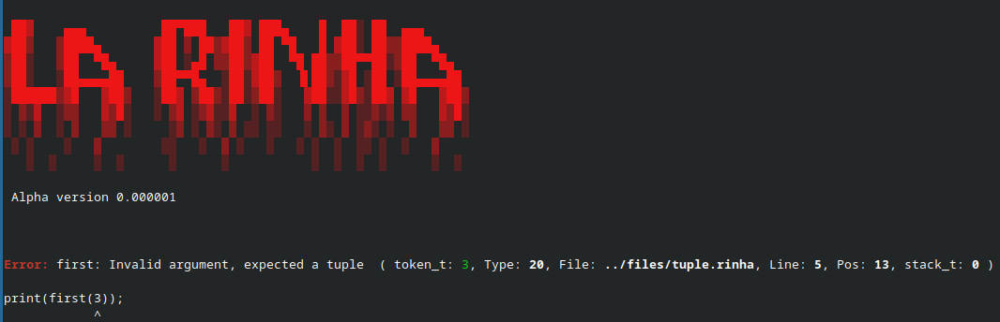

<div align="center">

 </div>

</div>

## What is that?

`La-Rinha` is an interpreter for the `rinha language` written in C.

This was a fun challenge created for a competition of interpreters and compilers by a group of independent developers using various programming languages. You can find more details [here](https://github.com/aripiprazole/rinha-de-compiler/blob/main/SPECS.md).

And if you're interested in learning how ancient primates used to create their programming languages, you've come to the right place! There are no `flex`, `bison`, `llvm`, or any other dependencies and dark magic tricks here—just good old pure `C` using the standard library, simple optimizations, and perhaps some questionable design guided by `XGH`. **:)**

I also tried to provide minimal in-code documentation so that it could be expanded later and generate some useful reference if processed by `Doxygen` or any other automatic documentation tool.

------------------------------------------
## Quick guide

### Build
```bash
make
```

### Test

```bash
make test
```

### Run

```bash
./src/la-rinha /path/to/file/source.rinha
```

-------------------------------------------

### Docker build

```bash
make docker
```
or
```bash
docker build -t la-rinha:latest .
```
### Docker run

```bash
docker run -v /path/to/file.rinha:/var/rinha/source.rinha la-rinha:latest
```
